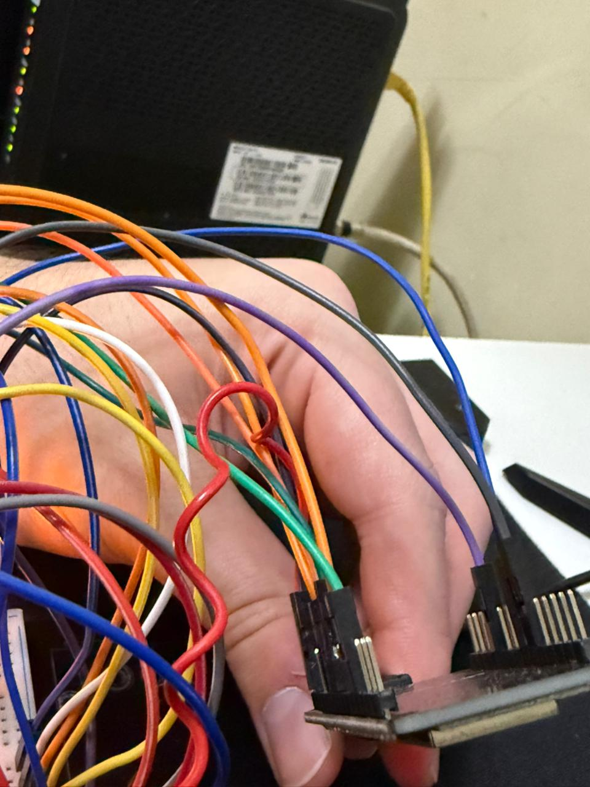
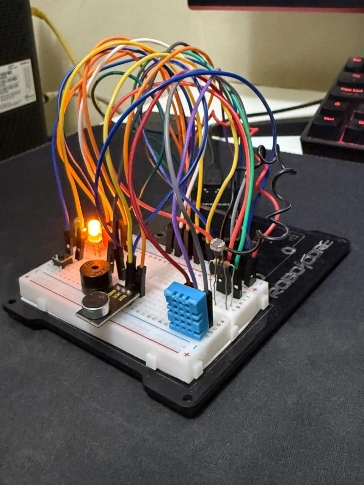
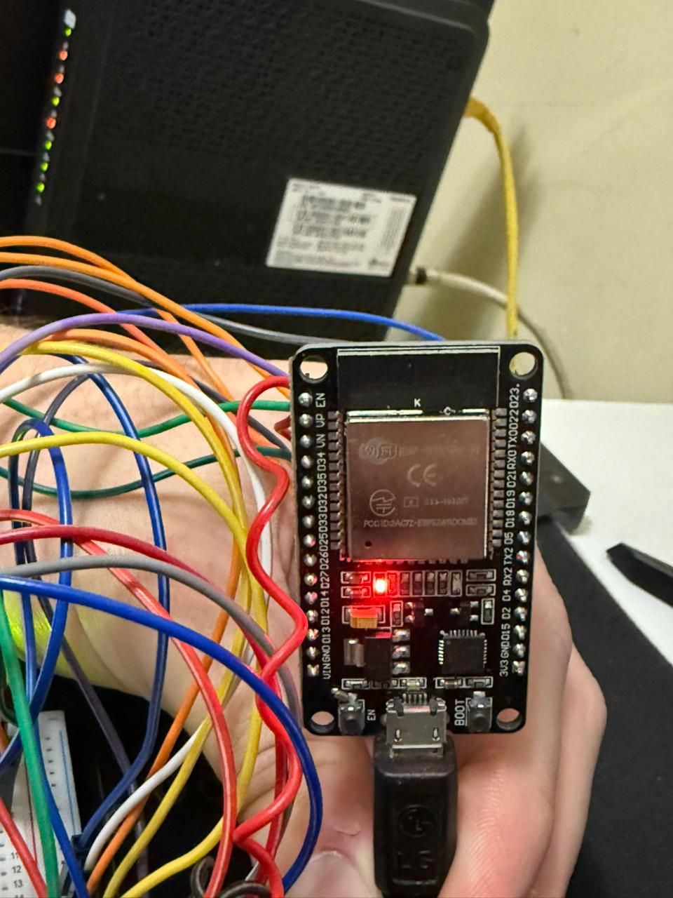
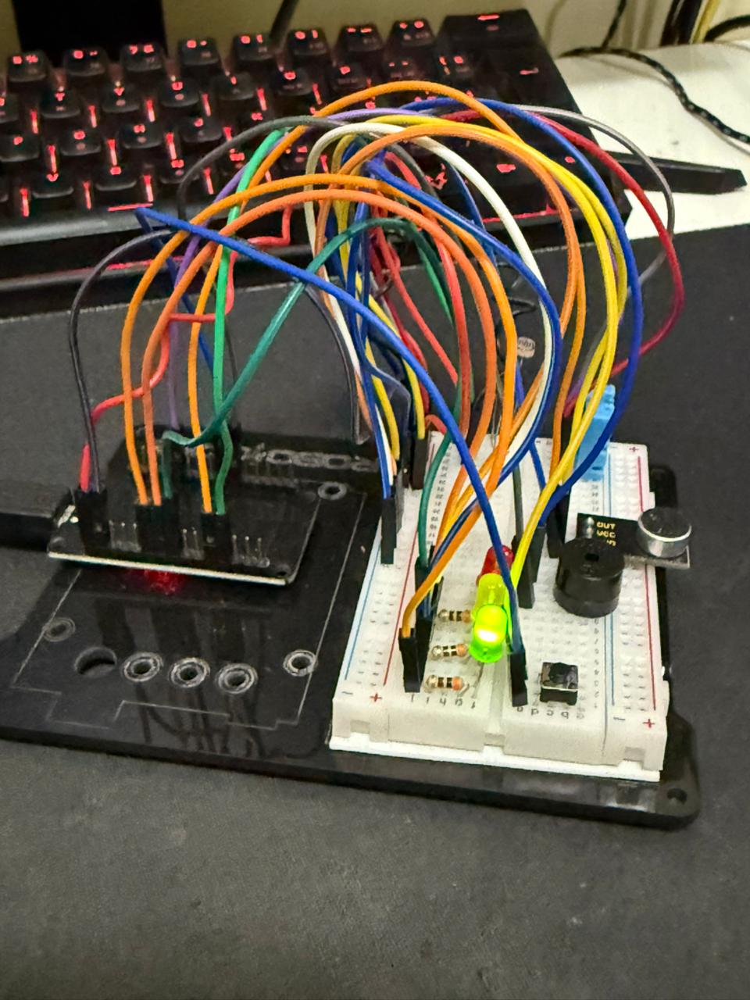

# GS physcal Computing 

# 📱🌌 ÓRBITA Mobile – Desk IoT

Projeto desenvolvido para a **Global Solution 2025 – IoT (FIAP)** e **totalmente integrado** ao ecossistema **ÓRBITA Mobile** (GS de Mobile).  

Aqui, o **ESP32** monitora o ambiente de trabalho (luz e ruído), calcula um **Índice de Conforto**, envia tudo de forma **automatizada** para uma API, que alimenta:

- ✅ Um **dashboard web** em tempo real  
- ✅ A aplicação **ÓRBITA Mobile**, onde **os mesmos gráficos e funções** estão disponíveis para o usuário no celular

> Ou seja: este repositório é o módulo IoT da solução **ÓRBITA Mobile** – Futuro do Trabalho.

---

## 🎯 Problema

No contexto de trabalho híbrido e remoto, muitos profissionais trabalham em ambientes:

- Com **iluminação inadequada**;
- Com **ruído excessivo**;
- Sem qualquer feedback sobre o conforto do espaço.

Isso compromete **foco, produtividade e bem-estar** (cansaço visual, dor de cabeça, estresse).  
Falta uma forma simples de **medir, visualizar e reagir** a essas condições — tanto no desktop quanto no **dispositivo móvel**.

---

## 💡 Solução Proposta

O **ÓRBITA Mobile – Desk IoT** é uma estação inteligente de bem-estar que:

- Usa um **ESP32 DevKit V1** para ler:
  - 🌡️ *Temperatura* e 💧 *umidade* (DHT11)  
  - 💡 *Luminosidade* (LDR calibrado para o ambiente real)  
  - 🔊 *Ruído ambiente* (sensor de som)
- Calcula um **Índice de Conforto (0–100)** baseado principalmente em **luz e som** (foco no ambiente físico da estação de trabalho);
- Exibe o estado atual em um **semáforo físico**:
  - 🟢 Verde – ambiente confortável  
  - 🟡 Amarelo – atenção  
  - 🔴 Vermelho – ambiente ruim
- Emite alertas via **buzzer** quando o score fica crítico (com opção de *mute* pelo botão);
- Envia tudo **automaticamente**, via **HTTP (JSON)**, para uma API Node.js;

Esses dados alimentam:

1. Um **dashboard web** em tempo real (desktop);
2. A aplicação **ÓRBITA Mobile**, que consome os mesmos endpoints para exibir gráficos, evolução e status direto no smartphone.


###🖼️ Imagens do Circuito






---

## 🤖 Fluxo Automatizado

Depois de configurado:

1. O ESP32 liga e conecta ao WiFi;
2. Você inicia uma sessão com um **clique curto no botão**;
3. O sistema passa a:
   - Ler sensores periodicamente;
   - Calcular o score;
   - Atualizar LEDs e buzzer;
   - Enviar automaticamente as métricas para a API.

Do lado da aplicação:

- O **dashboard web** busca `/api/metrics` automaticamente;
- O **ÓRBITA Mobile** consome os mesmos dados via HTTP para montar:
  - Gráficos,
  - Resumos,
  - Feedback visual para o usuário.

Tudo isso **sem intervenção manual** após o início da sessão.

---

## 🧱 Arquitetura da Solução

**Camadas principais:**

1. **Dispositivo IoT (ESP32 DevKit V1)**  
   - Lê sensores (DHT11, LDR, ruído);  
   - Calcula o Índice de Conforto;  
   - Controla LEDs, botão e buzzer;  
   - Envia JSON via HTTP para o backend.

2. **Backend (API HTTP – Node.js + Express)**  
   - Recebe `POST /api/metrics` do ESP32;  
   - Mantém um histórico em memória;  
   - Expõe `GET /api/metrics` para:
     - Dashboard web
     - App ÓRBITA Mobile (GS Mobile).

3. **Dashboard Web (HTML + Chart.js)**  
   - Atualiza métricas em tempo real;  
   - Renderiza gráficos e cards com últimos valores;  
   - Mostra o status da sessão e interpretação do score.

4. **App ÓRBITA Mobile (GS Mobile)**  
   - Consome a mesma API HTTP;  
   - Exibe gráficos, score e histórico diretamente no celular;  
   - Permite que o usuário acompanhe a qualidade do ambiente de trabalho na mesma plataforma onde gerencia suas trilhas de carreira.

> Isso demonstra, na prática, integração entre **IoT, backend e front-end web/mobile** no contexto do Futuro do Trabalho.

---

## 🔌 Hardware Utilizado

| Componente                 | Função                            |
|---------------------------|-----------------------------------|
| ESP32 DevKit V1           | Microcontrolador / WiFi           |
| DHT11                     | Sensor de temperatura e umidade   |
| LDR + resistor            | Sensor de luminosidade            |
| Sensor de ruído (microfone/mod.) | Nível de som ambiente   |
| LED Verde                 | Ambiente bom                      |
| LED Amarelo               | Alerta                            |
| LED Vermelho              | Ambiente ruim                     |
| Buzzer                    | Alerta sonoro                     |
| Push button               | Início/fim de sessão + mute buzzer|
| Protoboard + jumpers      | Montagem do circuito              |
| Fonte 5V (USB)            | Alimentação do ESP32              |

### 🧷 Mapeamento de Pinos (ESP32)

| Função                | Pino ESP32 |
|----------------------|------------|
| DHT11 (data)         | **GPIO 4** |
| LDR (divisor de tensão) | **GPIO 34 (ADC)** |
| Sensor de ruído      | **GPIO 35 (ADC)** |
| Botão (INPUT_PULLUP) | **GPIO 18** (botão → GND) |
| Buzzer               | **GPIO 19** |
| LED Vermelho         | **GPIO 25** |
| LED Amarelo          | **GPIO 26** |
| LED Verde            | **GPIO 27** |

---

## 🔭 Lógica do Dispositivo (ESP32)

O firmware `.ino`:

- Conecta ao WiFi usando SSID/senha configurados;
- Aguarda **clique curto** no botão para iniciar a sessão de trabalho;
- Em modo sessão ativa:
  - Lê DHT11, LDR e ruído;
  - Converte luz e som para **0–100%**, com **calibração do LDR** (adaptado ao seu ambiente real);
  - Calcula o **Índice de Conforto** usando **apenas luz + ruído**;
  - Define LEDs:
    - 🟢 score ≥ 85  
    - 🟡 65 ≤ score < 85  
    - 🔴 score < 65
  - Liga buzzer se `score < 45` (a não ser que esteja mutado);
  - Envia JSON para `POST /api/metrics`.

### 🎛 Funções do botão

- **Clique curto:**  
  ➜ Inicia ou encerra a **sessão de trabalho** (`workingSession`).

- **Clique longo (≥ 2s):**  
  ➜ Alterna **mute/unmute do buzzer** (sem desligar o monitoramento).


### 📦 JSON enviado (exemplo)

```json
{
  "userId": "orbita-001",
  "temperature": 25.3,
  "humidity": 48.2,
  "light": 1650,
  "noise": 1320,
  "score": 82,
  "working": true,
  "workMinutes": 3,
  "timestamp": 123456789
}

